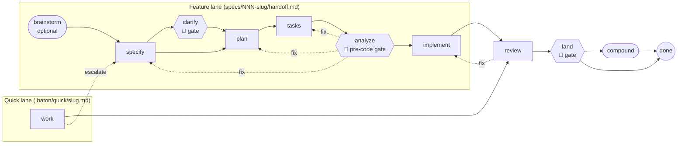

<div align="center">

# 🏃 Baton

**Spec-driven relays for Copilot agents.**

Baton combines [GitHub Spec Kit](https://github.com/github/spec-kit) and the
[ATV Starter Kit](https://github.com/All-The-Vibes/ATV-StarterKit) into one GitHub template. Specs, plans, tasks
and reviews are passed between agents and humans like a relay baton. Each pass carries exactly the context the next
runner needs, and each pass is validated.

[](LICENSE)
[](https://github.com/github/spec-kit/releases/tag/v1.0.11)
[](https://github.com/All-The-Vibes/ATV-StarterKit/tree/ad996736b879be87c7755df5c5017d5336203bbc)


[Why Baton](#why-baton) · [Quick start](#quick-start) · [How the relay works](#how-the-relay-works) ·
[Your first feature](#your-first-feature) · [Reference](#reference) · [Credits](#credits-and-licensing)

</div>

---

## Contents

- [Why Baton](#why-baton)
- [What you get](#what-you-get)
- [Project status](#project-status)
- [Quick start](#quick-start)
- [How the relay works](#how-the-relay-works)
- [Your first feature](#your-first-feature)
- [The quick lane](#the-quick-lane)
- [Anatomy of a baton](#anatomy-of-a-baton)
- [Human gates](#human-gates)
- [Model routing](#model-routing)
- [Packs](#packs)
- [How the two kits are combined](#how-the-two-kits-are-combined)
- [Enforcement and CI](#enforcement-and-ci)
- [Reference](#reference)
- [Configuration](#configuration)
- [Updating from upstream](#updating-from-upstream)
- [Troubleshooting](#troubleshooting)
- [Repository layout](#repository-layout)
- [Roadmap](#roadmap)
- [Contributing](#contributing)
- [Credits and licensing](#credits-and-licensing)

## Why Baton

Spec Kit and ATV are both excellent, and both are opinionated. If you install them side by side, you get:

- **Two planners and two artifact roots.** `ce-plan` writes to `docs/plans/`, `/speckit-plan` writes to `specs/`,
  and agents pick one at random.
- **Lost context between phases.** Each new session re-reads everything, or too little, and guesses what the
  previous agent decided.
- **Unvalidated handoffs.** Nothing checks that the spec has success criteria, that analyze found no critical
  issues, or that the files the plan was based on haven't changed since.
- **Silent gaps.** An agent that hits an open question often picks an answer instead of stopping.
- **Hard-coded models.** Upstream prompts name specific models, and there is no single place to route planning,
  implementation and review to the right one.

Baton fixes this with a small set of rules and one file per feature: the **baton** (`handoff.md`).

| Principle | What it means in practice |
|---|---|
| One workflow, one owner per phase | `/speckit-plan` is the only planner, feature artifacts live only in `specs/NNN-slug/`, and every phase has exactly one owning skill. |
| Validated handoffs | Every phase ends by writing a baton with exit criteria, `read_first` files with SHA-256 hashes, decisions, open questions and a next owner. The next phase refuses to start if the baton is invalid or stale. |
| Stop, don't choose | A blocking open question sets `status: needs-human`. Agents stop and ask; they never pick an answer for you. |
| Humans hold the gates | Clarify, the pre-code gate after analyze, and land need a recorded human approval. No pipeline skips a gate. |
| Upstream stays pristine | Upstream files are never hand-edited. They come from pinned, checksummed snapshots, so updates stay mechanical. |
| Minimal by default | A curated core of skills and agents, and everything else in optional packs. |
| Configurable model routing | Phases map to roles (planning, implementation, review, fast); roles map to models in one config file. |
| Cheap, strict, local-first | The same checks run locally and in CI, on free hosted runners, with SHA-pinned actions. |

## What you get

- **The Spec Kit workflow** (v1.0.11, Copilot integration, skills mode): constitution, specify, clarify, plan, tasks,
  analyze, implement, converge and checklist.
- **The best of ATV** (pinned commit): brainstorming, headless multi-persona code review, `ce-work` for small
  changes, `land` for commit → push → PR, and `ce-compound` for recording what you learned in `docs/solutions/`.
- **Baton itself:**
  - a Spec Kit extension with mandatory `before_*` / `after_*` hooks around every Spec Kit phase;
  - wrapper skills `/baton`, `/baton-review` and `/baton-land`;
  - a dependency-free CLI bundled at `.baton/bin/baton.mjs` (Node.js ≥ 20, no `npm install` needed);
  - JSON Schemas for batons, phases, config and review findings;
  - a `baton.yml` workflow that validates every pull request.
- **Optional packs** with extra reviewers, research agents, stack-specific reviewers, security and design tooling.

## Project status

Baton is at **v0.1 (MVP)**. The relay and the template path work today; some convenience commands are still
being built.

| Area | Status |
|---|---|
| Template path ("Use this template" → automatic cleanup) | ✅ available |
| Relay: `handoff` receive/write/approve/answer/escalate/refresh/show/next, `validate`, `status`, `doctor` | ✅ available |
| Spec Kit hooks, `/baton`, `/baton-review`, `/baton-land`, quick lane | ✅ available |
| Pinned upstream sync with lock verification (`sync --check`, `lock verify`) | ✅ available (maintainers) |
| Adopter CI (`baton.yml`) | ✅ available |
| Overlay onto an existing repo (`baton init`), `init --packs`, `update`, `uninstall`, `models apply` | 🚧 planned for v0.1.0 release |
| Full manual under `docs/` | 🚧 in progress. This README is the manual for now |

Commands that aren't implemented yet exit with code 2 and change nothing.

## Quick start

### Prerequisites

- A GitHub account with GitHub Copilot. The CLI, VS Code agent mode and the Copilot cloud agent all work.
- **Node.js ≥ 20** and **git**.
- **bash** for the Spec Kit scripts. On Windows, use Git Bash or WSL.

### Start a new project from the template

1. Click **Use this template** → **Create a new repository** on this page.
2. Wait for the **Template cleanup** workflow on your first push to `main` (about a minute). It runs
   `baton adopt --no-workflows` and commits `chore: personalize Baton template`. The cleanup:
   - replaces this README with a short adopter README and moves the Baton manual to `docs/baton/`;
   - resets the constitution to Spec Kit's pristine template;
   - keeps `docs/brainstorms/` and `docs/solutions/`;
   - never touches `.github/workflows/`, because `GITHUB_TOKEN` can't push workflow changes.
3. Clone your new repository and check the installation:

   ```bash
   node .baton/bin/baton.mjs doctor
   ```

4. Open Copilot in the repository and write your project's principles:

   ```text
   /speckit-constitution
   ```

5. Start your first feature with `/speckit-specify <what you want to build>`, or type `/baton` to see where you are.

> [!TIP]
> If cleanup couldn't push (for example because of branch protection), run it locally:
> `node .baton/bin/baton.mjs adopt`, then push. Add `--dry-run` to preview it. Add `--prune-workflows` to also
> delete the dormant maintainer workflows.

### Add Baton to an existing repository

The overlay installer (`npx github:dermonaco-labs/baton#v0.1.0 init`) is planned for the v0.1.0 release. Until
then, start from the template, or copy `.baton/`, `.specify/` and the core `.github/skills` and `.github/agents` by
hand, then run `doctor`.

## How the relay works

There are two lanes. The **feature lane** is the full Spec Kit relay for anything that adds behavior or a public
contract. The **quick lane** is for small, contained changes. Both lanes end in the same review, land and compound
phases.



Every phase has an owner skill, a model role, entry checks, exit criteria and a list of legal next phases. The
defaults are built into the CLI (source: `baton/templates/phases.yml`); put a `.baton/phases.yml` in your repo to
override them:

| Phase | Lane | Owner (what you type) | Model role | Human gate | Exit criteria (summary) |
|---|---|---|---|---|---|
| brainstorm | feature | `/ce-brainstorm` | planning | – | a brainstorm doc in `docs/brainstorms/` |
| specify | feature | `/speckit-specify` | planning | – | `spec.md` with user stories, success criteria, bounded `NEEDS CLARIFICATION` markers |
| clarify | feature | `/speckit-clarify` | planning | ✅ | no clarification markers left; answers recorded |
| plan | feature | `/speckit-plan` | planning | – | `plan.md`, research, data model and contracts |
| tasks | feature | `/speckit-tasks` | planning | – | `tasks.md` whose tasks reference stories, plus a registered acceptance check per story |
| analyze | feature | `/speckit-analyze` | review | ✅ | `analysis.md` persisted; 0 CRITICAL findings |
| implement | feature | `/speckit-implement` | implementation | – | tasks checked or deferred, acceptance evidence recorded, local checks pass |
| work | quick | `/ce-work` (via `/baton`) | implementation | – | change stays within the declared quick scope |
| review | both | `/baton-review` | review | – | `review.json` valid; every finding mapped to a task or dismissed |
| land | both | `/baton-land` | implementation | ✅ | local checks pass; PR opened (never merged) |
| compound | both | `/ce-compound` | planning | – | a solution recorded in `docs/solutions/`, or an explicit skip |

Around every Spec Kit phase, the Baton extension runs two mandatory hooks:

- **`before_<phase>` → `/speckit-baton-receive`:** validates the incoming baton, checks the entry criteria, and
  refuses to start if an artifact hash is stale, a blocking question is open, or a gate is still pending.
- **`after_<phase>` → `/speckit-baton-handoff`:** evaluates the exit criteria, writes the outgoing baton with fresh
  hashes, and names the next owner and model role.

## Your first feature

Each step below is one Copilot session (or one turn). Start a fresh session whenever the model role changes. The
baton tells the next session what to read, so you don't need to paste context.

1. **Specify.** Describe the what and why, not the how:

   ```text
   /speckit-specify Let users export their reading list as CSV and JSON
   ```

   This creates `specs/001-reading-list-export/spec.md` and `handoff.md` with `next_phase: clarify` or `plan`.

2. **Clarify** (only if the spec has `NEEDS CLARIFICATION` markers). `/speckit-clarify` asks up to five targeted
   questions. Clarify is a human gate: you answer, and the agent records your answers.

3. **Plan.** `/speckit-plan` writes `plan.md`, `research.md`, `data-model.md`, `contracts/` and `quickstart.md`. For
   research it calls ATV's `repo-research-analyst` and `learnings-researcher`. It does not call a second planner.

4. **Tasks.** `/speckit-tasks` writes `tasks.md`: ordered, test-first tasks plus an **Acceptance Registry** that maps
   every user story to a concrete check (a test ID or command) that must fail first.

5. **Analyze.** `/speckit-analyze` checks spec, plan and tasks for consistency and coverage. The report is persisted
   to `analysis.md`. This is the **pre-code gate**: review it, then approve:

   ```bash
   node .baton/bin/baton.mjs handoff approve --feature 001-reading-list-export \
     --by "repository owner" --via "direct approval"
   ```

6. **Implement.** `/speckit-implement` works through `tasks.md` in order. Use `/speckit-converge` if the code has
   drifted from the plan and tasks are missing.

7. **Review.** `/baton-review` runs ATV's `ce-review` headless with the always-on personas (correctness, testing,
   maintainability, project standards, security, adversarial, agent-native) plus any installed pack reviewers. It
   takes intent from spec, plan and tasks, not just the PR text, and writes a validated `review.json`.

8. **Land.** `/baton-land` validates the baton and runs your local checks, then lets ATV's `land` commit, push and
   open a pull request. It never merges. Merging is your decision.

9. **Compound** (recommended). `/ce-compound` records what was learned in `docs/solutions/`. Later plan and review
   phases find it through `learnings-researcher`.

At any point, `/baton` or `node .baton/bin/baton.mjs status` shows where every feature stands:

```text
FEATURE                  LANE     PHASE    NEXT       OWNER              STATUS  GATE                                  STALE
001-reading-list-export  feature  analyze  implement  speckit-implement  ready   repository owner via direct approval  no
```

## The quick lane

Not everything deserves a spec. The quick lane (`work → review → land → compound`) is for small changes with **no
new behavior and no new public contract**: a bug fix with a clear cause, a dependency bump, a refactor, docs.

```bash
node .baton/bin/baton.mjs handoff new --quick fix-date-parsing --reason "off-by-one in timezone handling"
```

Or just type `/baton` and describe the change; it offers the quick lane when the change qualifies. The quick baton
lives in `.baton/quick/<slug>.md`.

- `ce-work` implements the change. A warning (`W_QUICK_LARGE`) fires when the diff touches more files than
  `lanes.quick.max_files_changed` (default 10).
- If the change turns out to need a spec, **escalate** instead of stretching the lane:

  ```bash
  node .baton/bin/baton.mjs handoff escalate --quick fix-date-parsing --reason "needs a new API field"
  ```

  This continues in the feature lane at specify, carrying the quick baton as evidence. The reverse (feature →
  quick) is not allowed.

## Anatomy of a baton

A baton is Markdown with YAML frontmatter. The frontmatter is machine-validated against
`handoff.schema.json` (`.baton/schemas/` in your repo); the body is for humans. An abridged example:

```yaml
---
baton: 1
lane: feature
feature: 001-reading-list-export
phase_completed: tasks
next_phase: analyze
next_owner: speckit-analyze
status: ready                    # ready | needs-human | blocked
model_role: review
suggested_model: claude-opus-5.5
summary: >-
  Export as CSV and JSON behind one endpoint. 14 tasks, 6 acceptance checks.
read_first:                      # at most 12 files, each with a hash
  - path: specs/001-reading-list-export/tasks.md
    why: the unit of work and the Acceptance Registry
    sha256: 3f1c…
do_not_read:
  - path: specs/001-reading-list-export/research.md
    why: folded into plan.md
exit_criteria:
  - { id: artifact-exists, met: true, evidence: specs/001-reading-list-export/tasks.md }
decisions:
  - { id: D1, decision: "CSV uses RFC 4180 quoting", rationale: "spreadsheet compatibility", by: planning-session }
open_questions: []               # a blocking question forces status: needs-human
assumptions:
  - { id: AS1, text: "Lists stay under 10k items", revisit_at: implement }
gate: { required: false }
---
## Goal
…
## Next steps
…
## Watch out for
…
```

The validator enforces, among other things:

- **Freshness:** every `read_first` and `artifacts` hash must match the file (`tasks.md` is hashed ignoring
  checkboxes, so ticking a task doesn't make the baton stale).
- **Budgets:** at most 12 `read_first` files, a summary of at most 600 characters, and a body of at most 150 lines.
- **Legal transitions:** `next_phase` must be allowed by `.baton/phases.yml` for the lane.
- **Stop, don't choose:** blocking open questions ⇒ `status: needs-human`.
- **Gates:** approvals are role-only text such as `repository owner via direct approval`, never a handle or email.
- **Privacy:** the `E_DENYLIST` scan rejects emails, `@mentions`, user-home paths and any terms you add to a
  denylist file.

Every error has a stable code (for example `E_STALE_ARTIFACT`, `E_EXIT_UNMET`, `E_GATE_PENDING`) and a fix hint.
The full list is in [`specs/001-baton-template/contracts/handoff-contract.md`](specs/001-baton-template/contracts/handoff-contract.md).

## Human gates

Three phases require a recorded human decision: **clarify**, **analyze** (the pre-code gate) and **land**. Agents
reach the gate, set the baton to wait, and stop (exit code 3, "needs human"). Record your approval with:

```bash
node .baton/bin/baton.mjs handoff approve --feature <NNN-slug> --by "<role>" --via "<channel>"
```

Roles and channels come from `.baton/config.yml` (`gates.approver_roles`, `gates.approval_channels`). The defaults
include `repository owner`, `maintainer`, `reviewer`, and `direct approval`, `pull request review`. Answer a
recorded open question with:

```bash
node .baton/bin/baton.mjs handoff answer Q1 "option b" --feature <NNN-slug> --by "maintainer"
```

## Model routing

Phases map to **roles**, and roles map to **models**, in `.baton/config.yml`:

```yaml
models:
  roles:
    planning:       { model: claude-opus-5.5, reasoning: high }
    implementation: { model: gpt-6-sol, reasoning: high }
    review:         { model: claude-opus-5.5, reasoning: high }
    fast:           { model: claude-haiku-4.5 }
  phase_roles: {}        # override the role of a phase, e.g. { tasks: fast }
  allowed: []            # optional allow list; empty = any model
  enforce: warn          # warn | error
  apply_to_agents: false # opt-in: write `model:` into agent frontmatter
```

The defaults are dated suggestions, not requirements. Change them to whatever your organization has access to.

- The baton carries `model_role` and `suggested_model` for the next phase.
- `node .baton/bin/baton.mjs handoff next --feature <NNN-slug>` prints the next command, role and model.
- Start the next session with that model: `/model` in Copilot CLI, the model picker in VS Code, or the model
  setting of the cloud agent.
- `doctor` warns when a configured model isn't in your `allowed` list. Upstream prompts that mention specific models
  are advisory; your config decides.

## Packs

The **core** is the minimal complete relay: the Spec Kit phase skills, Baton's wrappers and hooks, ATV's
`ce-brainstorm`, `ce-work`, `ce-review`, `land`, `ce-compound`, and nine agents (the seven always-on review personas
plus `repo-research-analyst` and `learnings-researcher`). Everything else is an optional pack under `packs/`:

| Pack | Adds | Use it when |
|---|---|---|
| `review-plus` | performance, API-contract, data-migration, reliability, CLI-readiness, previous-comments and code-simplicity reviewers; schema-drift and deployment-verification agents; performance-oracle, data-integrity-guardian, pattern-recognition-specialist | you want deeper conditional reviews and `ce-compound` enhancements |
| `docs-review` | `document-review`, `ce-compound-refresh`, and seven document reviewers (coherence, feasibility, scope, product lens, design lens, security lens, adversarial) | you want advisory reviews of spec and plan prose |
| `research` | best-practices and framework-docs researchers, git-history analyzer, issue-intelligence analyst | planning needs external research |
| `security` | `atv-security` and `security-sentinel` | you need a deeper audit than the core security persona |
| `learning` | `observe`, `learn`, `instincts`, `evolve` and the observer hook | you want local pattern learning (opt-in, writes local telemetry) |
| `issues` | `speckit-taskstoissues` | you want GitHub issues from `tasks.md` |
| `stack-python` / `stack-typescript` / `stack-rails` | stack-specific reviewers | you work in that stack |
| `design` | `frontend-design`, design-implementation reviewer, Figma sync, design iterator | you build UI |

Packs are **closed**: every skill or agent a pack's files reference or dispatch must be in the pack, in core, or
listed as an optional reference with a reason. `sync` fails with `E_DANGLING_REF` otherwise. When core refers to
something a pack provides, `validate` and `doctor` print `W_PACK_RECOMMENDED`, a warning that tells you which pack
would enable it. `init --packs <ids>` for installing packs is planned; see [Project status](#project-status).

## How the two kits are combined

Where Spec Kit and ATV overlap, one wins, and the rules are written down (13 rules in
[`contracts/conflict-rules.md`](specs/001-baton-template/contracts/conflict-rules.md)). The most important ones:

| Topic | Rule |
|---|---|
| Artifacts | Feature artifacts live only in `specs/NNN-slug/`. `docs/plans/` is not used. Brainstorms go in `docs/brainstorms/`, learnings in `docs/solutions/`. |
| Planner | `/speckit-plan` is the only planner. `ce-plan` and `deepen-plan` are not installed. |
| Executor | Features use `/speckit-implement`. `ce-work` is only for the quick lane. |
| Review | `/baton-review` → `ce-review` (headless), with intent from spec, plan and tasks. |
| Shipping | `/baton-land` → `land`. It never merges. Spec Kit's git extension is not installed, so commits are never automated twice. |
| Autonomy | `lfg`, `slfg` and `ralph-loop` are excluded. No pipeline may skip a human gate. |
| Instructions | Baton owns its marked section of `.github/copilot-instructions.md`, and Spec Kit owns its own. |
| Models | The role config decides; model names in upstream prompts are advisory. |

## Enforcement and CI

Spec Kit hooks are prompt-driven, so an agent can skip them. Baton therefore checks the relay in three places:

1. **In the agent:** the mandatory `before_*` / `after_*` hooks and the wrapper skills.
2. **Locally:** `node .baton/bin/baton.mjs validate` (also run by your `checks`, and by `/baton-land` before
   pushing).
3. **On the server:** `.github/workflows/baton.yml` runs `validate --github` and `doctor` on every pull request and
   push to `main`. It needs no secrets, uses least-privilege permissions and SHA-pinned actions, and has a
   five-minute timeout on free hosted runners.

For the strongest guarantee, make the **Baton** check required in a branch ruleset for `main`.

## Reference

### Skills (core)

| Skill | When to use it | Hands off to |
|---|---|---|
| `/baton` | Anytime: shows the relay status, routes you to the next owner, or starts a quick-lane change | the next owner |
| `/speckit-constitution` | Once per project, and whenever principles change | `/speckit-specify` |
| `/ce-brainstorm` | Before specify, when the problem or scope is still fuzzy | `/speckit-specify` |
| `/speckit-specify` | To start a feature: what and why | `/speckit-clarify` or `/speckit-plan` |
| `/speckit-clarify` | When the spec has `NEEDS CLARIFICATION` markers (human gate) | `/speckit-plan` |
| `/speckit-plan` | To design the how: research, data model, contracts | `/speckit-tasks` |
| `/speckit-tasks` | To break the plan into ordered, test-first tasks | `/speckit-analyze` |
| `/speckit-checklist` | Optional: quality checklists for requirements ("unit tests for English") | – |
| `/speckit-analyze` | Consistency and coverage check before code (pre-code gate) | `/speckit-implement` |
| `/speckit-implement` | To execute `tasks.md` | `/baton-review` |
| `/speckit-converge` | When code and tasks have drifted: appends missing work to `tasks.md` | `/speckit-implement` |
| `/ce-work` | Quick lane only: implement a small change | `/baton-review` |
| `/baton-review` | Multi-persona review with validated findings | `/baton-land` or back to implement |
| `/baton-land` | Validate, run checks, commit, push, open a PR (never merges; human gate) | `/ce-compound` |
| `/ce-compound` | Record a solved problem in `docs/solutions/` | done |
| `/speckit-baton-receive`, `/speckit-baton-handoff` | Run automatically by the hooks; call them manually only to repair a relay | – |

`ce-review` and `land` are also installed; the Baton wrappers call them for you.

### Agents (core)

| Agent | Role |
|---|---|
| `correctness-reviewer`, `testing-reviewer`, `maintainability-reviewer`, `project-standards-reviewer`, `security-reviewer`, `adversarial-reviewer`, `agent-native-reviewer` | always-on review personas used by `/baton-review` |
| `repo-research-analyst` | codebase research during plan |
| `learnings-researcher` | searches `docs/solutions/` during plan and review |

### CLI

Run the CLI with `node .baton/bin/baton.mjs <command>`. Global flags: `--cwd <dir>`, `--json` (stable
machine-readable output), `--github` (workflow annotations), `--quiet`.

| Command | What it does |
|---|---|
| `status` | Table of all features and quick changes: phase, next owner, status, gate, staleness |
| `validate [--path <file-or-dir> \| --changed]` | Validates batons, phases, config, frontmatter of skills and agents, and the manifest |
| `doctor [--strict]` | Checks the installation: pins, manifest integrity, hook registration, prerequisites, misplaced setup steps, models |
| `handoff show \| next` | Prints the current baton, or the next command, role and model |
| `handoff receive --phase <p>` | Validates the incoming baton and entry checks before a phase (used by the hooks) |
| `handoff write --phase <p> --from-json <file>` | Writes the outgoing baton from the agent's result (used by the hooks) |
| `handoff approve --by <role> [--via <channel>] [--at <date>]` | Records a human gate approval |
| `handoff answer <Q-id> <choice> --by <role>` | Records the answer to an open question |
| `handoff new --quick <slug> --reason <why>` | Starts a quick-lane baton |
| `handoff escalate --quick <slug> --reason <why>` | Moves a quick change into the feature lane |
| `handoff refresh --reason <why>` | Re-hashes artifacts after an intentional edit and records a decision |
| `handoff init --feature <NNN-slug> --infer` | Creates a baton for an existing feature directory |
| `adopt [--dry-run] [--no-workflows \| --prune-workflows]` | Personalizes a repository created from the template |
| `sync --check`, `sync --bump …`, `lock verify`, `build --check`, `manifest` | Maintainer commands for upstream snapshots and the bundle |

Most `handoff` commands take `--feature <NNN-slug>` or `--quick <slug>`; with a single feature it is inferred.

Exit codes: `0` ok · `1` validation errors · `2` usage · `3` needs a human · `4` conflicts · `5` missing
prerequisite · `10` internal error.

## Configuration

Everything adopters tune lives in `.baton/`:

| File | Purpose |
|---|---|
| `.baton/config.yml` | packs, quick-lane limits, gate roles and channels, denylist terms file, model routing, local `checks`, baton budgets |
| `.baton/phases.yml` (optional) | overrides the built-in phase contracts: owners, roles, gates, entry and exit criteria, legal transitions. Exit criteria can use `all_of` / `any_of` groups |
| `.baton/manifest.json` | installed files and their hashes (generated; don't edit) |
| `.baton/schemas/` | JSON Schemas for batons, phases, config, packs, lock, manifest, findings and skill/agent frontmatter (installed by `adopt`) |

Add your own project checks under `checks`. They run before land and in the `local-checks-pass` exit criterion:

```yaml
checks:
  - name: test
    run: npm test
  - name: lint
    run: npm run lint
```

Overrides that weaken a built-in contract (for example removing an exit check) are allowed, but `validate` warns
with `W_WEAKENED_CONTRACT` so it's visible in review.

## Updating from upstream

Upstream content is **vendored, pinned and checksummed**, never hand-edited:

- `baton.lock.json` records the Spec Kit tag and commit (installed from hash-locked requirements), and the ATV
  commit and tree IDs, plus the SHA-256 of every vendored file.
- `node .baton/bin/baton.mjs sync --check` rebuilds the snapshot from the pins and fails if anything differs.
- `node .baton/bin/baton.mjs lock verify` checks the working tree against the lock.
- Maintainers bump an upstream deliberately with `sync --bump`, review the diff, and record it in the CHANGELOG
  under "Upstream".
- Needed fixes to upstream files are declared in `packs/repairs.yml` and applied by `sync`, never edited by hand.

ATV is pinned to a commit on `main` rather than npm `atv-starterkit` 2.6.3, because most agent templates in that
release have broken frontmatter; the fix is unreleased as of this writing.

For adopters, `baton update` (a three-way update that keeps your local changes and reports conflicts) is planned for
the v0.1.0 release.

## Troubleshooting

| Symptom | Fix |
|---|---|
| `E_STALE_ARTIFACT` | A file in `read_first` changed after the baton was written. If the edit was intentional, run `handoff refresh --reason "…"`; otherwise re-run the phase. |
| Exit code 3 / `E_GATE_PENDING` | A human gate is waiting. Review, then run `handoff approve`. |
| `status: needs-human` | A blocking open question. Answer it with `handoff answer`. |
| `E_EXIT_UNMET` | The phase isn't done: the error lists which exit criterion failed and why. |
| Hooks don't fire | Run `doctor`. It checks that the Baton hooks are registered in `.specify/extensions.yml`. CI still validates the PR. |
| `E_APPROVER_FORMAT` | Use role-only text from your config, for example `--by "maintainer" --via "pull request review"`. |
| `E_DENYLIST` | A baton contains an email, `@mention` or home path. Replace it with a role. |
| `W_PACK_RECOMMENDED` | Informational: a pack would enable an optional enhancement. Safe to ignore. |
| Template cleanup failed | Run `node .baton/bin/baton.mjs adopt` locally and push. |
| Spec Kit scripts fail on Windows | Run them from Git Bash or WSL. |
| No registry access on your machine | The CLI is bundled and needs no `npm install`. Run registry-dependent maintainer tasks in a container or in CI. |

## Repository layout

```text
.baton/                 config, phase contracts, schemas, manifest and the bundled CLI (bin/baton.mjs)
.github/
  skills/               core skills (Spec Kit, ATV and Baton wrappers)
  agents/               core agents (review personas and researchers)
  workflows/            baton.yml (adopter CI), template-cleanup.yml
  copilot-instructions.md
.specify/               Spec Kit (templates, scripts, memory/constitution.md, the Baton extension and preset)
baton/                  Baton's own sources: Spec Kit extension and preset, instructions, schemas, templates (incl. default phases.yml)
packs/                  pack definitions (*.yml) and optional pack payloads (packs/<id>/files/)
docs/                   the manual, brainstorms/ and solutions/
specs/001-baton-template/  Baton's own spec, plan, tasks, contracts and baton (Baton built with Baton)
src/, test/             CLI sources and tests
baton.lock.json         upstream pins and file checksums
THIRD_PARTY_NOTICES.md  attribution for all vendored material
```

## Roadmap

The post-v0.1 backlog is in [`specs/001-baton-template/roadmap.md`](specs/001-baton-template/roadmap.md). Highlights:

- **v0.2:**
  - dispatching task groups to the Copilot cloud agent;
  - path-specific instruction files;
  - context budget warnings;
  - `baton handoff diff`;
  - a rulesets template;
  - a devcontainer.
- **v0.3:**
  - parallel implement across worktrees;
  - task-level model routing;
  - relay evals that measure handoff quality.
- **Optional packs:**
  - a current-docs MCP server;
  - agentic workflows;
  - a MemPalace memory index.

## Contributing

Baton is developed with Baton. Every change starts as a feature in `specs/` and goes through the relay, or through
the quick lane if it qualifies.

```bash
npm ci
npm run check    # markdown and YAML lint, typecheck, bundle check, lock verify, validate, tests
```

`npm run check` is exactly what CI runs. Please don't hand-edit vendored upstream files; change the pins or
`packs/repairs.yml` instead. Issues and pull requests are welcome.

## Credits and licensing

Baton is released under the [MIT License](LICENSE).

It stands on the shoulders of two MIT-licensed projects, and it would not exist without them:

- **[GitHub Spec Kit](https://github.com/github/spec-kit)** by GitHub. It provides the spec-driven development
  workflow, templates, scripts and `/speckit-*` skills. Vendored at v1.0.11.
- **[ATV Starter Kit](https://github.com/All-The-Vibes/ATV-StarterKit)** by All-The-Vibes. It provides the
  compound-engineering skills and the review agents. Vendored at commit `ad99673`.

Full copyright notices and license texts for all vendored and bundled material are in
[THIRD_PARTY_NOTICES.md](THIRD_PARTY_NOTICES.md). Content without a compatible license is excluded. Baton is an
independent project and is not affiliated with or endorsed by GitHub or All-The-Vibes.
