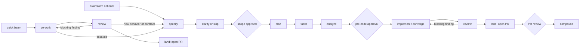

# Workflow and conflict rules

The feature lane runs `/speckit-specify` → `/speckit-clarify` (if
necessary) → `/speckit-plan` → `/speckit-tasks` → `/speckit-analyze` →
`/speckit-implement` (and `/speckit-converge` for gaps) → `/baton-review`
→ `/baton-land` → `/ce-compound`. Brainstorming with `/ce-brainstorm` is
optional before a feature directory exists. Spec Kit hooks in
`.specify/extensions.yml` receive and write the baton around each of its
phases. The review wrapper calls `ce-review mode:headless` and stores
normalized findings in `review.json`; landing delegates to `/land` but
never merges the PR.

The quick lane is for a change with **no new user-facing behavior or public
contract**. Start with
`node .baton/bin/baton.mjs handoff new --quick fix-typo --reason "docs typo, no behavior change"`;
`/baton` wraps `/ce-work` with receive/write calls, followed by
`/baton-review` and `/baton-land`. Quick review may return to work for
blocking findings. A new behavior or contract requires
`handoff escalate --quick fix-typo --reason "<why>"` and
`/speckit-specify`; the latter owns feature numbering. No feature-to-quick
transition exists. `W_QUICK_LARGE` is a file-count hint, not automatic
permission to cross that boundary.

**Human gates:** scope approval follows clarify, or specify when clarify is
skipped; pre-code approval follows analyze; land opens a PR for human review.
Use `handoff approve --by "<role>" [--via "<channel>"]` with a configured
role and channel, never a person's name, handle or email. A blocking
question means `needs-human`; record its answer with
`handoff answer <id> "<choice>" --by "<role>"`. `receive` exits 3 until
the gate/question is resolved. `handoff next` prints the command and model
suggestion; models do not grant approval. See [handoffs](04-handoffs.md).

## Precedence and conflicts

The order is constitution → current baton → feature artifacts
(`spec.md` > `plan.md` > `tasks.md`) → BATON instructions → upstream
prompts. Record any override as a baton decision.

| Rule | Resolution |
|---|---|
| C1 | Feature files live only in `specs/NNN-slug/`; brainstorms in `docs/brainstorms/`, solutions in `docs/solutions/`, quick batons in `.baton/quick/`. Never create `docs/plans/`. |
| C2 | `/speckit-plan` is the sole planner. In Phase 0 consult `repo-research-analyst` and `learnings-researcher`; do not install `ce-plan` or `deepen-plan`. |
| C3 | Features with `tasks.md` use `/speckit-implement` and `/speckit-converge`; `/ce-work` runs only in the quick lane. |
| C4 | Before coding use `/speckit-analyze`; code review uses `/baton-review` → `ce-review mode:headless` grounded in spec, plan and tasks. `/speckit-checklist` checks requirements quality; optional `document-review` is advisory. |
| C5 | `/baton-land` delegates to `/land`. Do not use Spec Kit git or duplicate commit automation; never auto-merge. |
| C6 | No autonomous shortcut (`lfg`, `slfg`, `ralph-loop`) may bypass a human gate. |
| C7 | Baton owns only `<!-- BATON:START -->` through `<!-- BATON:END -->`; Spec Kit owns its SPECKIT markers; everything else belongs to the adopter. Do not install ATV's competing instructions. |
| C8 | Mandatory Spec Kit hooks belong in `.specify/extensions.yml`. Copilot lifecycle hooks are installed only by a pack that declares them (`learning`); hook entries merge by command without reordering. |
| C9 | Setup steps belong only at `.github/workflows/copilot-setup-steps.yml`, not `.github/copilot-setup-steps.yml`. |
| C10 | `/ce-compound` writes `docs/solutions/`; `learnings-researcher` reads it. Learned skills from optional `learning` require human review before commit. |
| C11 | Invoke skills as `/speckit-<command>`; extension hooks as `/speckit-baton-receive` and `/speckit-baton-handoff`; wrappers as `/baton`, `/baton-review`, `/baton-land`. |
| C12 | Upstream model names are advisory. `.baton/config.yml` role routing and `handoff next` determine the suggestion. |
| C13 | Exclude unlicensed `karpathy-guidelines`, gstack, agent-browser, duplicate planners/autonomy tools, ATV setup/update/doctor, takeoff and unrelated media tools. `brainstorming` joins core only if dependency closure requires it. |

See [packs](06-packs-and-customization.md) for the installed set and
[updating](07-updating.md) for upstream ownership.
