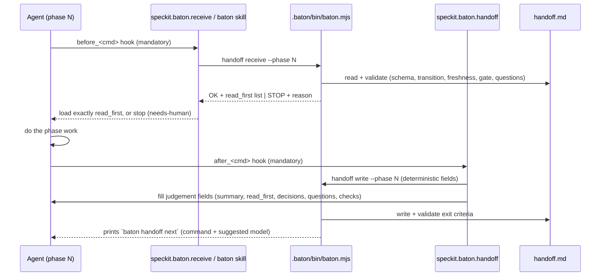

# Contract: The Baton (handoff.md)

This contract defines the file, the validator rules and the error codes. The field-level schema is in
[../data-model.md §1](../data-model.md). The JSON Schema is implemented at `baton/schemas/handoff.schema.json`.

## Annotated example (feature lane, after `tasks`)

```markdown
---
baton: 1
lane: feature
feature: 002-export-csv
phase_completed: tasks
next_phase: analyze
next_owner: speckit-analyze
status: ready
model_role: review
suggested_model: claude-opus-5.5
summary: >-
  18 tasks in 4 phases; US1 (export) is the MVP. Acceptance checks pre-registered for US1-US2.
read_first:
  - { path: specs/002-export-csv/tasks.md, why: "unit of work", sha256: "…" }
  - { path: specs/002-export-csv/spec.md,  why: "FR-001..FR-009 are what analyze checks", sha256: "…" }
  - { path: specs/002-export-csv/plan.md,  why: "structure + constitution check", sha256: "…" }
do_not_read:
  - { path: specs/002-export-csv/research.md, why: "decisions already folded into plan.md" }
artifacts:
  - { path: specs/002-export-csv/spec.md,  role: source-of-truth, sha256: "…" }
  - { path: specs/002-export-csv/plan.md,  role: source-of-truth, sha256: "…" }
  - { path: specs/002-export-csv/tasks.md, role: derived,         sha256: "…" }
entry_checked:
  - { id: plan-exists, ok: true }
  - { id: no-blocking-questions, ok: true }
exit_criteria:
  - { id: artifact-exists:tasks.md, met: true }
  - { id: tasks-reference-stories, met: true, evidence: "every task has [USn] or is Setup/Polish" }
  - { id: acceptance-registered, met: true, evidence: "AC-US1-1..3, AC-US2-1" }
acceptance_checks:
  - { id: AC-US1-1, story: US1, check: "npm test -- export.csv.header", kind: test-id, expect_initial: fail }
open_questions: []
decisions:
  - { id: D1, decision: "Stream rows instead of buffering", rationale: "SC-003 memory bound", by: speckit-plan }
gate: { required: false, approved_by: null, approved_at: null }
history:
  - { phase: specify, at: 2026-09-24T09:00:00Z, by: speckit-specify, commit: 1a2b3c4 }
  - { phase: clarify, at: 2026-09-24T09:20:00Z, by: "human:maintainer", commit: 2b3c4d5 }
  - { phase: plan,    at: 2026-09-24T10:05:00Z, by: speckit-plan, commit: 3c4d5e6 }
  - { phase: tasks,   at: 2026-09-24T10:30:00Z, by: speckit-tasks, commit: 4d5e6f7 }
updated_at: 2026-09-24T10:30:00Z
updated_by: speckit-tasks
---
## Goal
Export filtered results as CSV (US1), with column selection (US2).

## What changed
tasks.md created (18 tasks). Acceptance checks registered in tasks.md § Acceptance Registry.

## Next steps
1. `/speckit-analyze` (model role: review → claude-opus-5.5)
2. On a clean report: `baton handoff approve --by "maintainer" --via "direct approval"` (analyze is a human gate)

## Watch out for
- T007 and T008 both touch `src/export/writer.ts`, so they are not parallel.
```

## Lifecycle



## Validator rules (`baton validate` and `baton handoff receive|write`)

| Code | Severity | Rule |
|---|---|---|
| `E_SCHEMA` | error | The frontmatter fails `handoff.schema.json` (the message includes the JSON pointer). |
| `E_BODY_SECTIONS` | error | The body is missing a required heading, or the headings are out of order. |
| `E_BUDGET` | error | `read_first` has more entries than the budget, or the body is longer than the line budget. |
| `E_TRANSITION` | error | `phase_completed → next_phase` is not allowed by `phases.yml`, or `specify → plan` is used while `[NEEDS CLARIFICATION]` markers remain. |
| `E_OWNER` | error | `next_owner` ≠ `phases.yml[next_phase].owner`, and no recorded decision overrides it. |
| `E_MISSING_ARTIFACT` | error | A required artifact or a `read_first` path does not exist. |
| `E_STALE_ARTIFACT` | error | A listed sha256 ≠ the current file hash (`tasks.md` is hashed checkbox-insensitively, see data-model §1). Fix it by re-running the phase or with `baton handoff refresh --reason`. |
| `E_BLOCKING_OPEN` | error | There is a blocking open question and `status` = `ready`. |
| `E_EXIT_UNMET` | error | `status: ready`, but some `exit_criteria.met` is false. |
| `E_GATE_PENDING` | error (on receive) | The previous phase requires a human gate and `gate.approved_by` is null. |
| `E_APPROVER_FORMAT` | error | `gate.approved_by` isn't `<role>` or `<role> via <channel>` from `config.gates` (data-model §1.1), or only one of `approved_by` / `approved_at` is set. |
| `E_ACTOR_FORMAT` | error | A `by` / `updated_by` value isn't an agent id or `human:<role-slug>` from `config.gates.approver_roles`. |
| `E_DENYLIST` | error | Personal data found by the denylist scan (below). |
| `E_NO_PREREG` | error | `next_phase: implement` and any in-scope user story has no `acceptance_checks`. |
| `E_ANALYSIS_MISSING` | error | `phase_completed: analyze` without `analysis.report_path`, or the file doesn't exist. |
| `E_ANALYSIS_CRITICAL` | error (on receive of implement) | `analysis.critical > 0`. |
| `E_REVIEW_MISSING` | error | `phase_completed: review` without `review.findings_path`, or the file fails `findings.schema.json`. |
| `E_REVIEW_BLOCKING` | error (on receive of land) | `review.blocking_findings > 0`. |
| `E_PR_MISSING` | error | `phase_completed: land` without `pr.url`. |
| `E_LANE_ESCALATE` | error | Quick lane: `quick-scope-held` is unmet (the review found new behaviour or a new contract). Move to the feature lane (`baton handoff escalate`). |
| `E_LANE_MISMATCH` | error | The baton's `lane` isn't listed in the phase's `lane`, e.g. `receive --phase work` on a feature baton (phase-contracts § Quick lane). |
| `E_MODEL_NOT_ALLOWED` | error/warn | The `suggested_model` or an agent's `model:` is not in `models.allowed` (the severity comes from `enforce`). |
| `E_MULTIPLE_BATONS` | error | More than one handoff file exists in a feature dir. |
| `W_ASSUMPTION_DUE` | warn | An assumption's `revisit_at` equals the current phase. |
| `W_WEAKENED_CONTRACT` | warn | A `phases.yml` override removed a built-in exit check, or moved it into an `any_of` group with a new alternative. |
| `W_QUICK_LARGE` | warn | A quick-lane diff touches more files than `config.lanes.quick.max_files_changed`. |
| `W_NO_BATON` | warn | A feature dir has spec.md but no handoff.md. Suggests `baton handoff init --infer`. |

Validator codes outside batons (the same output format, listed in `docs/reference/error-codes.md`):

| Code | Rule |
|---|---|
| `E_FRONTMATTER_MALFORMED` | Skill or agent frontmatter doesn't start at byte 0 with `---\n`, fails to parse, or fails its schema. |
| `E_CONFIG` / `E_PHASES` / `E_MANIFEST` / `E_PACK` / `E_LOCK` | The file fails its schema. |
| `E_CHECK_UNKNOWN` | A `phases.yml` leaf uses an id that isn't a built-in check. |
| `E_CHECK_GROUP` | A check group is malformed: missing or colliding `id`, fewer than 2 or more than 8 members, nesting deeper than 2, or both/neither of `all_of`/`any_of` (data-model §2.1). |
| `E_CHECK_KEY_DUP` | Two expressions in one `entry` or `exit` list have the same check key. |
| `E_LOCK_MISMATCH` | A locked file's sha256 ≠ the working tree (`lock verify`). |
| `E_SYNC_DRIFT` | `sync --check` output ≠ the committed snapshot. |
| `E_DANGLING_REF` | A vendored file references a skill or agent that isn't installed and isn't in `optional_refs`. |
| `E_LICENSE` | An upstream file, or an npm package bundled into `baton.mjs`, has no MIT-compatible license or no entry in `THIRD_PARTY_NOTICES.md`. |
| `E_UNDOCUMENTED` | An installed core skill, agent or command is missing from `docs/reference/`. |
| `E_BUNDLE_STALE` | `.baton/bin/baton.mjs` doesn't match a fresh build. |
| `E_UPSTREAM_VERIFY` | A fetched upstream doesn't match the lock: the ATV commit or tree id, a Spec Kit requirement hash, or a file's `sha256_upstream`. |
| `W_SETUP_STEPS_MISPLACED` | `.github/copilot-setup-steps.yml` exists (it belongs under `.github/workflows/`). |
| `W_NO_ADOPTER_CI` | `.github/workflows/baton.yml` is missing, so skipped hooks would go unnoticed. |

## Personal-data denylist scan (`E_DENYLIST`)

Batons record people by role only (data-model §1.1). `baton validate` scans every baton (frontmatter and body) and,
in the Baton repo, every Baton-authored file (`docs/`, `specs/`, `baton/`, `README.md`, `.github/` except vendored
upstream files), and reports `E_DENYLIST` for:

1. an email address (`[\w.+-]+@[\w-]+\.[\w.-]+`), except the fixed noreply trailer address and addresses listed in
   `SECURITY.md`'s reporting section when that section says so explicitly;
2. an `@mention` (`(^|[\s(])@[A-Za-z0-9-]{1,39}\b`);
3. an absolute user-home path (`[A-Za-z]:\\Users\\`, `/home/<x>/`, `/Users/<x>/`);
4. a `human:` actor or an `approved_by` value outside the configured role vocabulary (reported as the more specific
   `E_ACTOR_FORMAT` / `E_APPROVER_FORMAT`);
5. any term from the optional terms file (`config.denylist.terms_file` or env `BATON_DENYLIST_FILE`, one
   case-insensitive term per line). This file holds real names and hostnames, so it MUST NOT be committed; keep it
   untracked or outside the repo.

Scope rules: in baton frontmatter every string value is scanned. In Markdown bodies and docs, rules 1–3 skip code
spans and fenced code (so docs can show patterns and counter-examples), while rule 5 applies everywhere.
`test/fixtures/` is excluded from the repository-wide scan, but `validate --path <fixture>` scans it, so the
`E_DENYLIST.md` fixture still fails.
The role vocabulary and the Approver/Actor patterns contain no `@`, `.`, `/`, `\` or upper case, so no valid
approval can trip rules 1–3. `CODEOWNERS` and `dependabot.yml` are exempt, because GitHub requires handles there.
Exit codes: `0` ok, `1` errors, `2` usage error, `3` stopped because `needs-human` (receive only). Output is human
text by default. `--json` emits `{ok, errors:[{code, file, pointer?, message, fix}]}`, and `--github` emits workflow
annotations.

## Stop, don't choose (normative)

An agent that finds ambiguity affecting scope, behaviour, security, data or public contracts MUST do the following:

1. Add `open_questions[{blocking: true, options: [...]}]`.
2. Set `status: needs-human`.
3. Write the baton.
4. Stop and print the question.

`receive` refuses to start the next phase (exit 3) until a human answers. The human does this with
`baton handoff answer <id> "<choice>" --by "<role>"`, which moves the answer to `decisions` and recomputes
`status`.
