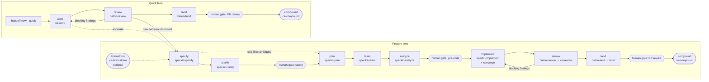

# Contract: Phase Contracts

This file is the normative source for `.baton/phases.yml` defaults. The built-in check ids are implemented in
`src/lib/phases.mjs`.

## The relay

## Phase table (defaults)

| Phase | Owner | Role | Gate after | Entry (built-in ids) | Exit (built-in ids) | Next |
|---|---|---|---|---|---|---|
| brainstorm | `ce-brainstorm` | planning | – | – | `artifact-exists:docs/brainstorms/*` | specify |
| specify | `speckit-specify` | planning | yes, if clarify is skipped | `from-phase:{none,brainstorm,work,review}` (the last two only via `--from-quick`) | `artifact-exists:spec.md`, `spec-has-stories`, `spec-has-success-criteria`, `markers-bounded` (≤ 3 `[NEEDS CLARIFICATION]`) | clarify, plan |
| clarify | `speckit-clarify` | planning | **yes (scope)** | `spec-exists` | `no-needs-clarification:spec.md`, `clarifications-recorded` | plan |
| plan | `speckit-plan` | planning | – | `spec-exists`, `from-phase:{specify,clarify}`, `gate-approved`, `no-blocking-questions` | `artifact-exists:plan.md`, `artifact-exists:research.md`, `no-needs-clarification:plan.md`, `constitution-check-present` | tasks |
| tasks | `speckit-tasks` | planning | – | `plan-exists`, `no-blocking-questions` | `artifact-exists:tasks.md`, `tasks-reference-stories`, `acceptance-registered` | analyze |
| analyze | `speckit-analyze` | review | **yes (pre-code)** | `tasks-exists`, `fresh:spec,plan,tasks` | `analysis-recorded` (`specs/<f>/analysis.md`, persisted by `speckit.baton.handoff` because upstream analyze is read-only), `no-critical-findings` | implement (or back to specify, plan or tasks) |
| implement | `speckit-implement` (+ `speckit-converge` re-entry) | implementation | – | `gate-approved`, `acceptance-registered`, `fresh:spec,plan,tasks` | `tasks-all-checked-or-deferred`, `acceptance-evidence` (each check has a red→green or n/a note), `local-checks-pass` | review |
| review | `baton-review` → `ce-review` | review | – | `diff-nonempty`, `fresh:tasks` | `findings-json-valid`, `findings-mapped-to-tasks-or-dismissed` | land, implement |
| land | `baton-land` → `land` | implementation | **yes (PR review)** | `no-blocking-findings`, `local-checks-pass` | `pr-opened` | compound, done |
| compound | `ce-compound` | planning | – | `pr-opened` | group `compound-recorded` = `any_of` [`artifact-exists:docs/solutions/*.md`, `decision:skip-compound`] (data-model §2.1) | done |

Entry and exit cells use the check keys of data-model §2.1. The phase table is the feature lane; `review`, `land`
and `compound` are shared with the quick lane, which overrides them through `by_lane.quick` (below).

## Quick lane

The quick lane is for changes that add no new user-facing behaviour and no new public contract (conflict rule C3).
Its baton is `.baton/quick/<slug>.md` (`lane: quick`, `feature: <slug>`, slug `^[a-z0-9][a-z0-9-]{1,48}$`), and its
findings file is `.baton/quick/<slug>.review.json`. `{quick_dir}` in check paths is `.baton/quick/`.

| Phase | Owner (`next_owner`) | Role | Gate after | Entry | Exit | Next |
|---|---|---|---|---|---|---|
| (start) | `baton` skill: `baton handoff new --quick <slug> --reason "<why>"` | – | – | the slug is unused; no `specs/*/` dir claims the change | writes the baton with `phase_completed: none`, `next_phase: work`, and a decision tagged `quick-eligible` holding the reason | work |
| work | `ce-work` | implementation | – | `from-phase:{none,review}`, `decision:quick-eligible`, `no-blocking-questions`, `no-feature-tasks` | `diff-nonempty`, `local-checks-pass` | review, specify (escalate) |
| review | `baton-review` → `ce-review` | review | – | `diff-nonempty` | `findings-json-valid`, `findings-fixed-or-dismissed`, `quick-scope-held` | land, work, specify (escalate) |
| land | `baton-land` → `land` | implementation | **yes (PR review)** | `no-blocking-findings`, `local-checks-pass` | `pr-opened` | compound, done |
| compound | `ce-compound` | planning | – | `pr-opened` | `compound-recorded` (same group as the feature lane) | done |

- **Required artifacts**: the quick baton (always); the diff vs the merge-base (after work; `read_first` lists the
  changed files, at most the budget); `.baton/quick/<slug>.review.json` (after review, role `review`); `pr.url`
  (after land). There is no spec, plan or tasks file, so `fresh:*` and `acceptance-registered` don't apply.
- **Gates**: only the PR-review gate after land (`gate.required: true` is set by `handoff write --phase land`).
  `approved_by` follows data-model §1.1. There is no scope or pre-code gate; the `quick-eligible` decision replaces
  the scope gate, and escalation is the safety valve.
- **Hooks**: `ce-work` is an ATV skill without Spec Kit hooks, so the `baton` skill runs
  `handoff receive --phase work --quick <slug>` before it and `handoff write --phase work --quick <slug>` after it.
  `baton-review`, `baton-land` and the compound step call receive/write themselves, with `--quick <slug>`.
- **Loop**: review → work is chosen automatically when `review.blocking_findings > 0`.
- **Size hint**: `W_QUICK_LARGE` when the diff touches more than `config.lanes.quick.max_files_changed` files. It's a
  warning, not an escalation.

### Transitions between the lanes

| From | To | Legal? | How |
|---|---|---|---|
| quick `work` or `review` | feature `specify` | ✓ | `baton handoff escalate --quick <slug> --reason R` (also triggered by `quick-scope-held` failing with `E_LANE_ESCALATE`). It sets the quick baton to `next_phase: specify`, `next_owner: speckit-specify`, `status: ready`. `/speckit-specify` creates the feature dir; its `handoff write --phase specify --from-quick .baton/quick/<slug>.md` records the quick baton as an `evidence` artifact and copies its last history entry, which satisfies `from-phase:{…,work,review}`. The quick baton is then closed: `status: done`, `next_phase: done`, a decision tagged `escalated` naming the feature dir. |
| quick `land`/`compound` | feature | ✗ | the change has shipped as a PR; start a new feature normally. |
| any feature phase | quick `work` | ✗ `E_TRANSITION` | conflict rule C3: a feature with tasks.md uses `speckit-implement`/`speckit-converge`. Follow-up fixes after a feature lands start a **new** quick baton, which is not a transition. |
| feature baton + quick phase, or the reverse | – | ✗ `E_LANE_MISMATCH` | the baton's `lane` must be listed in the phase's `lane` (or `by_lane`). |

## What the next agent receives (context contract)

| Transition | `read_first` (ordered, required) | Typical `do_not_read` |
|---|---|---|
| brainstorm → specify | brainstorm doc | – |
| specify → clarify | spec.md | brainstorm doc (already folded in) |
| clarify → plan | spec.md, constitution.md | – |
| plan → tasks | plan.md, spec.md, data-model.md, contracts/* | research.md (folded into plan) |
| tasks → analyze | tasks.md, spec.md, plan.md | research.md |
| analyze → implement | tasks.md, plan.md, contracts/*, analysis.md, quickstart.md | spec.md prose beyond the FR/SC lists |
| implement → review | changed-files list, tasks.md, spec.md (FR/SC), plan.md structure | research.md |
| review → land | review.json, tasks.md | – |
| land → compound | PR URL, review.json, baton decisions | – |
| quick: start → work | the quick baton (reason), files named in the reason | `specs/` |
| quick: work → review | changed-files list, the quick baton | `specs/` |
| quick: review → land | `<slug>.review.json`, changed-files list | – |

## Built-in check ids (implementation notes)

- `artifact-exists:<glob>`: the path is relative to the feature dir unless it starts with `docs/` or `.`.
- `fresh:<names>`: sha256 comparison against the `artifacts` recorded in the current baton.
- `markers-bounded`: counts `[NEEDS CLARIFICATION` occurrences (Spec Kit's convention) and allows at most 3.
- `tasks-reference-stories`: each `- [ ] T\d{3}` line in a story phase carries `[US\d+]`.
- `acceptance-registered`: tasks.md has a `## Acceptance Registry` table (added by the `baton-templates` preset).
  Every in-scope story has ≥ 1 row, and the rows are mirrored into `acceptance_checks`.
- `local-checks-pass`: runs each `config.checks[*].run` and records the exit codes as evidence.
- `findings-json-valid`: validates `review.json` against Baton's own `.baton/schemas/findings.schema.json`. `baton-review`
  runs `ce-review mode:headless` and normalizes its structured findings into that file (data-model §8), so no
  upstream-internal schema or file layout is load-bearing.
- `analysis-recorded`: `analysis.report_path` exists. Spec Kit's `speckit-analyze` is strictly read-only and only
  prints its report, so `speckit.baton.handoff` (after_analyze hook) writes the chat report verbatim to
  `specs/<f>/analysis.md` and fills `analysis.critical`/`analysis.high`.
- `from-phase:{a,b}` (check key `from-phase:a,b`): the baton's `phase_completed` (or, for the first feature baton, the history entry copied by
  `--from-brainstorm` / `--from-quick`) is one of the listed phases. `none` matches a fresh quick baton.
- `decision:<tag>`: `decisions[]` has an entry with that `tag` and a non-empty `rationale`.
- `no-feature-tasks`: the diff since the merge-base touches nothing under `specs/`, and no `specs/*/handoff.md` has
  `feature` equal to the slug (conflict rule C3).
- `findings-fixed-or-dismissed` (quick lane): every finding in review.json has `disposition` `fixed`, or `dismissed`
  with a `reason` (there are no tasks to map to).
- `quick-scope-held` (quick lane): the reviewer recorded no new user-facing behaviour or public contract. If unmet,
  the error is `E_LANE_ESCALATE`.
- `no-critical-findings`: parses the analysis.md table for CRITICAL severity (the Spec Kit analyze output format).
  If parsing fails, the agent must set the result explicitly and the validator requires evidence text.

## Transition rules

- **Implicit gate entry.** When the previous phase has "Gate after", the next phase's entry implicitly starts with
  `gate-approved` (the table lists it explicitly only for plan and implement, for readability).
- **Branching.** For phases with several `Next` values, `baton handoff write` picks the first one unless
  `--next <phase>` is given. `specify --next plan` requires 0 `[NEEDS CLARIFICATION]` markers and sets
  `gate.required: true` (the scope gate moves to after specify). Review → implement is chosen automatically when
  `review.blocking_findings > 0`.
- **Brainstorm.** Brainstorm has no feature dir, so it writes no baton. The first baton is written after specify with
  `--from-brainstorm docs/brainstorms/<file>.md`, which records the doc as an `evidence` artifact and adds a
  `brainstorm` history entry. `from-phase:brainstorm` is satisfied by that history entry.
- **Escalation.** Quick lane → feature lane never creates feature dirs itself; Spec Kit keeps owning numbering and
  branch creation. The exact steps are in § Quick lane → Transitions between the lanes.