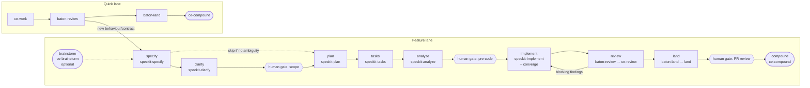

# Contract: Phase Contracts

This file is the normative source for `.baton/phases.yml` defaults. The built-in check ids are implemented in
`src/lib/phases.mjs`.

## The relay

## Phase table (defaults)

| Phase | Owner | Role | Gate after | Entry (built-in ids) | Exit (built-in ids) | Next |
|---|---|---|---|---|---|---|
| brainstorm | `ce-brainstorm` | planning | – | – | `artifact-exists:docs/brainstorms/*` | specify |
| specify | `speckit-specify` | planning | yes, if clarify is skipped | `from-phase:{none,brainstorm}` | `artifact-exists:spec.md`, `spec-has-stories`, `spec-has-success-criteria`, `markers-bounded` (≤ 3 `[NEEDS CLARIFICATION]`) | clarify, plan |
| clarify | `speckit-clarify` | planning | **yes (scope)** | `spec-exists` | `no-needs-clarification:spec.md`, `clarifications-recorded` | plan |
| plan | `speckit-plan` | planning | – | `spec-exists`, `from-phase:{specify,clarify}`, `gate-approved`, `no-blocking-questions` | `artifact-exists:plan.md`, `artifact-exists:research.md`, `no-needs-clarification:plan.md`, `constitution-check-present` | tasks |
| tasks | `speckit-tasks` | planning | – | `plan-exists`, `no-blocking-questions` | `artifact-exists:tasks.md`, `tasks-reference-stories`, `acceptance-registered` | analyze |
| analyze | `speckit-analyze` | review | **yes (pre-code)** | `tasks-exists`, `fresh:spec,plan,tasks` | `analysis-recorded` (`specs/<f>/analysis.md`, persisted by `speckit.baton.handoff` because upstream analyze is read-only), `no-critical-findings` | implement (or back to specify, plan or tasks) |
| implement | `speckit-implement` (+ `speckit-converge` re-entry) | implementation | – | `gate-approved`, `acceptance-registered`, `fresh:spec,plan,tasks` | `tasks-all-checked-or-deferred`, `acceptance-evidence` (each check has a red→green or n/a note), `local-checks-pass` | review |
| review | `baton-review` → `ce-review` | review | – | `diff-nonempty`, `fresh:tasks` | `findings-json-valid`, `findings-mapped-to-tasks-or-dismissed` | land, implement |
| land | `baton-land` → `land` | implementation | **yes (PR review)** | `no-blocking-findings`, `local-checks-pass` | `pr-opened` | compound, done |
| compound | `ce-compound` | planning | – | `pr-opened` | `artifact-exists:docs/solutions/*` or `decision:skip-compound` | done |

Quick lane: the owners are `ce-work`, then `baton-review`, `baton-land` and `ce-compound`. Entry into `ce-work` requires
`quick-eligible`, which means the change adds no new user-facing behaviour or public contract. The baton's
`summary` states the reason. The Quick lane has no gates except PR review.

## What the next agent receives (context contract)

| Transition | `read_first` (ordered, required) | Typical `do_not_read` |
|---|---|---|
| brainstorm → specify | brainstorm doc | – |
| specify → clarify | spec.md | brainstorm doc (already folded in) |
| clarify → plan | spec.md, constitution.md | – |
| plan → tasks | plan.md, spec.md, data-model.md, contracts/* | research.md (folded into plan) |
| tasks → analyze | tasks.md, spec.md, plan.md | research.md |
| analyze → implement | tasks.md, plan.md, contracts/*, analysis.md, quickstart.md | spec.md prose beyond the FR/SC lists |
| implement → review | changed-files list, tasks.md, spec.md (FR/SC), plan.md structure | research.md |
| review → land | review.json, tasks.md | – |
| land → compound | PR URL, review.json, baton decisions | – |

## Built-in check ids (implementation notes)

- `artifact-exists:<glob>`: the path is relative to the feature dir unless it starts with `docs/` or `.`.
- `fresh:<names>`: sha256 comparison against the `artifacts` recorded in the current baton.
- `markers-bounded`: counts `[NEEDS CLARIFICATION` occurrences (Spec Kit's convention) and allows at most 3.
- `tasks-reference-stories`: each `- [ ] T\d{3}` line in a story phase carries `[US\d+]`.
- `acceptance-registered`: tasks.md has a `## Acceptance Registry` table (added by the `baton-templates` preset).
  Every in-scope story has ≥ 1 row, and the rows are mirrored into `acceptance_checks`.
- `local-checks-pass`: runs each `config.checks[*].run` and records the exit codes as evidence.
- `findings-json-valid`: validates `review.json` against Baton's own `.baton/schemas/findings.schema.json`. `baton-review`
  runs `ce-review mode:headless` and normalizes its structured findings into that file (data-model §8), so no
  upstream-internal schema or file layout is load-bearing.
- `analysis-recorded`: `analysis.report_path` exists. Spec Kit's `speckit-analyze` is strictly read-only and only
  prints its report, so `speckit.baton.handoff` (after_analyze hook) writes the chat report verbatim to
  `specs/<f>/analysis.md` and fills `analysis.critical`/`analysis.high`.
- `no-critical-findings`: parses the analysis.md table for CRITICAL severity (the Spec Kit analyze output format).
  If parsing fails, the agent must set the result explicitly and the validator requires evidence text.

## Transition rules

- **Implicit gate entry.** When the previous phase has "Gate after", the next phase's entry implicitly starts with
  `gate-approved` (the table lists it explicitly only for plan and implement, for readability).
- **Branching.** For phases with several `Next` values, `baton handoff write` picks the first one unless
  `--next <phase>` is given. `specify --next plan` requires 0 `[NEEDS CLARIFICATION]` markers and sets
  `gate.required: true` (the scope gate moves to after specify). Review → implement is chosen automatically when
  `review.blocking_findings > 0`.
- **Brainstorm.** Brainstorm has no feature dir, so it writes no baton. The first baton is written after specify with
  `--from-brainstorm docs/brainstorms/<file>.md`, which records the doc as an `evidence` artifact and adds a
  `brainstorm` history entry. `from-phase:brainstorm` is satisfied by that history entry.
- **Escalation.** Quick lane → feature lane never creates feature dirs itself. `baton escalate` writes the quick baton
  with `next_phase: specify` and the reason, and `/speckit-specify` then takes the quick baton as its input, so
  Spec Kit keeps owning numbering and branch creation.